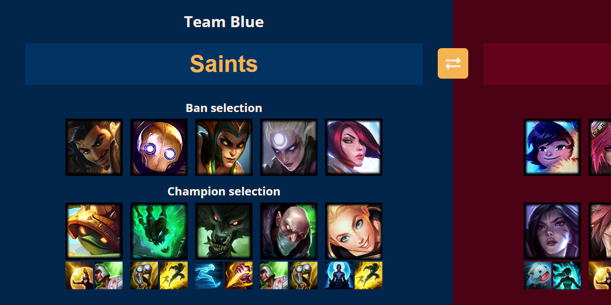

# League of Legends Rooster

Beautify League of Legends livestreams with champion and spell avatars on the screen without showing the in-game ban/selection phase.

- [League of Legends Rooster](#league-of-legends-rooster)
  - [Installation](#installation)
  - [Download & Setup](#download--setup)
  - [Server](#server)
  - [Access images through host](#access-images-through-host)
  - [Policy](#policy)

## Installation

First we need to make sure that NodeJS is installed and running on our marchine. This can be done by opening your terminal (CMD on Windows) and run `node -v`. If you are not using another package manager, then also check that NPM is installed by running `npm -v` in the terminal too.

If it is not installed, then please install it by running the following command matching your system/OS. You can also go to the link and download it manually if preferred. Once its installed then make sure to reboot your OS (Restart your computer if Windows) and check the commands from before again to make sure all is running.

| System (OS)  | Terminal command                       |
| ------------ | -------------------------------------- |
| **Linux**    | `sudo apt install nodejs`              |
| **Windows**  | `winget install -e --id OpenJS.NodeJS` |
| **Macbook**  | `brew install node`                    |
| **Download** | https://nodejs.org/en/download/        |

## Download & Setup

Now that NodeJS and a package manager is installed and ready to use, it's time to download the source code from a stable version. If you are on github then please go to "Releases" in the right sidebar and download the Source.zip from the latest stable release (Not "Pre-Release" or ending with either "-alpha" or "-beta").

Unpack the contents of the ZIP folder where you want the server to be located in your system. It would be recommended to place it somewhere with a short or easy route to navigate by terminal. Something like `C:\nodejs\lolrooster` on Windows.

Now open the folder and open `.env` in a simple editor; you can use Notepad on Windows and then make sure `DRAGON_API_VERSION="%"` is the latest version from here: [DDragon API Versions](https://ddragon.leagueoflegends.com/api/versions.json)

Now please navigate to the folder in your terminal (CMD on Windows) and type `cd C:\nodejs\lolrooster` (Or where ever you unpacked the ZIP folder) and run `npm run build` for it to download all champ and spell images from Riot. If you update the version later on then you can run `npm run download` to redownload all images.

Now that everything is setup and you are now ready to start the server. When you start the server it will attempt to build the cache files from `core/data/cache.js` or build it from new. All the cache files will be place inside the `cache/` folder.

## Server

To start the server please cd into the folder like before and then run `npm run server`. It will then prompt you with an/some IP-Addresses where the server is hosted; something like `http://ip:port/`. It should by default always be available at `http://127.0.0.1:port` where the default port is `3000` if not changed inside the `.env` file. Please note that any `127.x.x.x` IP-Addresses are internal and can only be access by the same device hosting the server.

The local network IP-Address that is shared should, if following the IPV4 structure, be something like `192.168.x.x`.

## Access images through host

All the interesting files that are exposed on the hosted server through various endpoints:

| Host path                    | Local path if any      | Description                                                |
| ---------------------------- | ---------------------- | ---------------------------------------------------------- |
| `http://ip:port/cache/...`   | `./cache/...`          | Access all cache files through the (local) network         |
| `http://ip:port/live/...`    |                        | Same as cache but with a fixed Refresh header of 2 seconds |
| `http://ip:port/default/...` | `./public/default/...` | Default/placeholder images                                 |
| `http://ip:port/champ/...`   | `./public/champ/..`.   | All downloaded champion avatars downloaded from Riot       |
| `http://ip:port/banner/...`  | `./public/banner/...`  | All downloaded champion banners downloaded from Riot       |
| `http://ip:port/spell/...`   | `./public/spell/...`   | All downloaded spell icons downloaded from Riot            |

Please note that these are the default sizes of the images downloaded from Riot:

| Image             | Size in pixels  |
| ----------------- | --------------- |
| Champ (or Ban) | `120w` x `120h` |
| Banner            | `308w` x `560h` |
| Spell             | `64w` x `64h`   |

## Policy

Please read the policies from Riot Games before the use of this code:  
https://developer.riotgames.com/policies/general